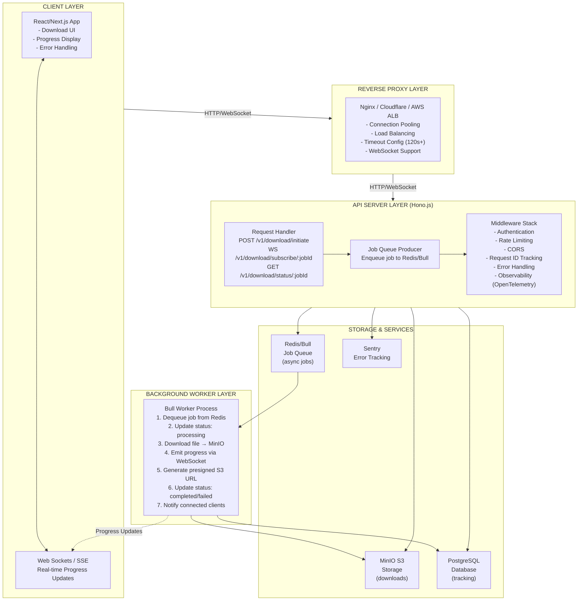
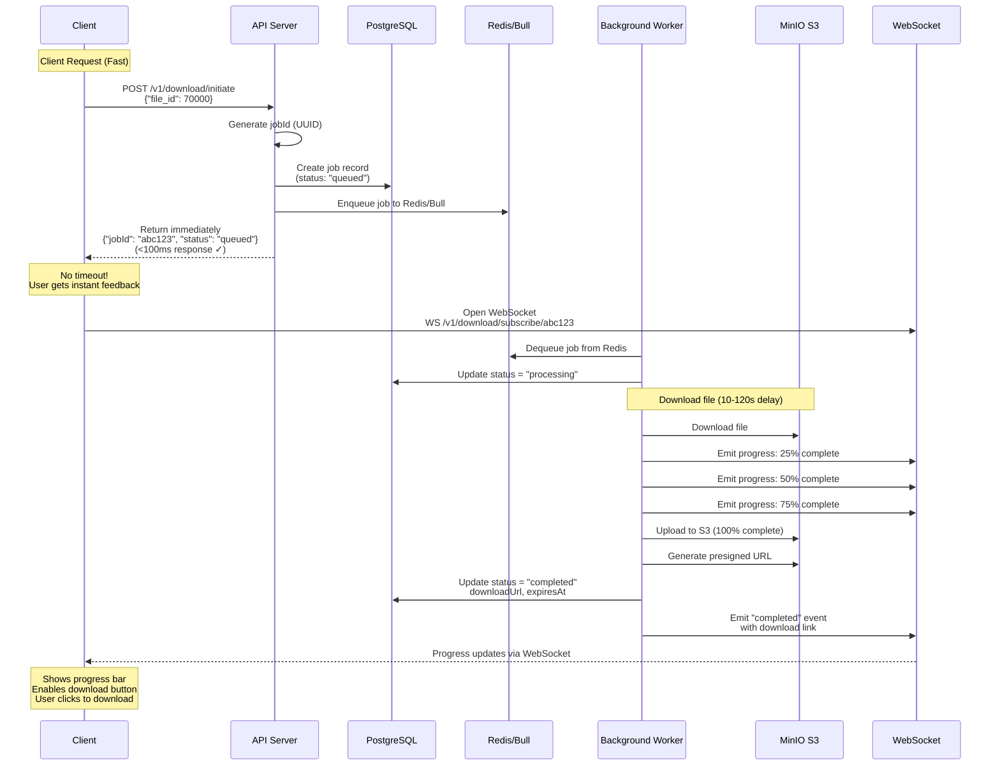

# Long-Running Download Architecture Design

> **Note:** This document uses [Mermaid](https://mermaid.js.org/) diagrams that are automatically rendered on GitHub. The diagrams will display as interactive visualizations when viewing this file on GitHub.

## Executive Summary

This document outlines a **complete architecture design** for integrating the Delineate download microservice with a fullstack application while gracefully handling variable download times (10-120+ seconds).

**Chosen Pattern:** Hybrid Approach combining **Polling + WebSocket** with asynchronous background processing

**Key Benefits:**

- Immediate response to client (no connection timeout)
- Real-time progress updates via WebSocket
- Fallback polling for simple clients
- Background job processing with Redis/Bull
- Presigned S3 URLs for direct downloads

---

## 1. Architecture Diagram

### System Architecture Overview



### Data Flow for Long-Running Download



---

## 2. Technical Approach: Hybrid Pattern (Polling + WebSocket + Async Queue)

### Why This Pattern?

| Pattern         | Pros                 | Cons                         | Use Case               |
| --------------- | -------------------- | ---------------------------- | ---------------------- |
| **Polling**     | Simple, stateless    | High latency, increased load | Mobile/legacy clients  |
| **WebSocket**   | Real-time, efficient | Complex, requires statefull  | Modern web apps        |
| **Webhook**     | Decoupled, reliable  | Complex to implement         | 3rd party integrations |
| **Async Queue** | Scalable, resilient  | Needs infrastructure         | Long-running tasks ✓   |

**Our Choice:** Combine all three for maximum flexibility:

- **Quick response** via immediate job acknowledgment (no timeout)
- **Real-time updates** via WebSocket (modern UX)
- **Polling fallback** via status endpoint (mobile/offline)
- **Async processing** via Bull/Redis (handle long delays)

### Architecture Pattern

```
Request → Quick Response (jobId) → Async Processing → Real-time Updates
  ↓            ↓                        ↓                      ↓
 10ms         50ms                   10-120s               Real-time
```

---

## 3. Implementation Details

### 3.1 API Contract Changes

#### Existing Endpoints (Modified)

```typescript
// POST /v1/download/start (DEPRECATED - keep for backward compatibility)
// Returns immediately with jobId instead of blocking
// Response: 202 Accepted with jobId

// NEW APPROACH:
POST /v1/download/initiate
Request:
{
  "file_ids": [70000, 70001, 70002],
  "priority": "normal",              // optional: normal | high | low
  "callbackUrl": "https://..."      // optional: webhook callback
}

Response: 202 Accepted
{
  "jobId": "550e8400-e29b-41d4-a716-446655440000",
  "status": "queued",
  "totalFiles": 3,
  "estimatedTimeMs": 95000,
  "queuePosition": 5,
  "createdAt": "2025-12-12T10:30:00Z"
}
```

#### New Endpoints

```typescript
// GET /v1/download/status/:jobId
// Poll current job status (fallback for non-WebSocket clients)

Response: 200 OK
{
  "jobId": "550e8400-e29b-41d4-a716-446655440000",
  "status": "processing",              // queued | processing | completed | failed
  "progress": {
    "completedFiles": 1,
    "totalFiles": 3,
    "percentComplete": 33,
    "currentFileId": 70001
  },
  "startedAt": "2025-12-12T10:30:05Z",
  "estimatedCompletionMs": 75000,
  "errors": []
}

---

// WebSocket: WS /v1/download/subscribe/:jobId
// Real-time progress streaming

Client sends:
{"action": "subscribe", "jobId": "abc123"}

Server sends events:
{
  "type": "progress",
  "jobId": "abc123",
  "progress": {
    "completedFiles": 1,
    "totalFiles": 3,
    "percentComplete": 33
  },
  "timestamp": "2025-12-12T10:30:30Z"
}

{
  "type": "completed",
  "jobId": "abc123",
  "downloadUrls": {
    "70000": "https://s3.example.com/downloads/70000.zip?token=xyz",
    "70001": "https://s3.example.com/downloads/70001.zip?token=abc",
    "70002": "https://s3.example.com/downloads/70002.zip?token=def"
  },
  "expiresAt": "2025-12-12T11:30:00Z"
}

---

// DELETE /v1/download/cancel/:jobId
// Cancel an in-progress download job

Response: 200 OK
{
  "jobId": "abc123",
  "status": "cancelled",
  "cancelledAt": "2025-12-12T10:31:00Z"
}
```

### 3.2 Database Schema

```sql
-- Jobs Table
CREATE TABLE download_jobs (
  id UUID PRIMARY KEY,
  user_id UUID NOT NULL,
  status ENUM('queued', 'processing', 'completed', 'failed', 'cancelled'),
  priority ENUM('low', 'normal', 'high') DEFAULT 'normal',
  file_ids INTEGER[] NOT NULL,
  completed_files INTEGER DEFAULT 0,
  created_at TIMESTAMP DEFAULT NOW(),
  started_at TIMESTAMP,
  completed_at TIMESTAMP,
  error_message TEXT,
  callback_url VARCHAR(2048),
  INDEX (user_id),
  INDEX (status),
  INDEX (created_at DESC)
);

-- Job Progress Tracking
CREATE TABLE job_progress (
  id BIGINT PRIMARY KEY AUTO_INCREMENT,
  job_id UUID NOT NULL REFERENCES download_jobs(id),
  file_id INTEGER NOT NULL,
  status ENUM('pending', 'downloading', 'stored', 'failed'),
  bytes_downloaded BIGINT,
  total_bytes BIGINT,
  error TEXT,
  updated_at TIMESTAMP DEFAULT NOW(),
  INDEX (job_id)
);

-- Presigned URLs Cache
CREATE TABLE presigned_urls (
  id UUID PRIMARY KEY,
  job_id UUID NOT NULL REFERENCES download_jobs(id),
  file_id INTEGER NOT NULL,
  s3_url TEXT NOT NULL,
  expires_at TIMESTAMP NOT NULL,
  created_at TIMESTAMP DEFAULT NOW(),
  INDEX (job_id),
  INDEX (expires_at)
);
```

### 3.3 Background Job Processing (Bull/Redis)

```typescript
import Bull from "bull";
import { Redis } from "ioredis";

// Initialize Bull queue
const downloadQueue = new Bull("downloads", {
  redis: {
    host: process.env.REDIS_HOST || "localhost",
    port: parseInt(process.env.REDIS_PORT || "6379"),
    maxRetriesPerRequest: null,
    enableReadyCheck: false,
  },
});

// Define job data structure
interface DownloadJobData {
  jobId: string;
  userId: string;
  fileIds: number[];
  callbackUrl?: string;
}

// Process jobs from queue
downloadQueue.process(
  10, // concurrency: 10 parallel jobs
  async (job: Bull.Job<DownloadJobData>) => {
    const { jobId, userId, fileIds, callbackUrl } = job.data;

    try {
      // Update job status to processing
      await db.updateJobStatus(jobId, "processing", { startedAt: new Date() });

      let downloadedCount = 0;
      const downloadUrls: Record<number, string> = {};

      for (const fileId of fileIds) {
        try {
          // Emit progress
          job.progress({
            completedFiles: downloadedCount,
            totalFiles: fileIds.length,
            percentComplete: Math.round(
              (downloadedCount / fileIds.length) * 100,
            ),
            currentFileId: fileId,
          });

          // Update progress in DB
          await db.updateFileProgress(jobId, fileId, "downloading");

          // Simulate download delay
          await sleep(getRandomDelay());

          // Upload to S3 (or fetch from source)
          const s3Key = `downloads/${fileId}.zip`;
          await s3Client.putObject({
            Bucket: process.env.S3_BUCKET_NAME,
            Key: s3Key,
            Body: Buffer.from(`File ${fileId} content`),
          });

          // Generate presigned URL (valid for 24 hours)
          const presignedUrl = await s3Client.getSignedUrlPromise("getObject", {
            Bucket: process.env.S3_BUCKET_NAME,
            Key: s3Key,
            Expires: 86400, // 24 hours
          });

          downloadUrls[fileId] = presignedUrl;
          downloadedCount++;

          await db.updateFileProgress(jobId, fileId, "stored");

          // Emit progress via WebSocket to connected clients
          await websocketManager.broadcastToJob(jobId, {
            type: "progress",
            progress: {
              completedFiles: downloadedCount,
              totalFiles: fileIds.length,
              percentComplete: Math.round(
                (downloadedCount / fileIds.length) * 100,
              ),
            },
          });
        } catch (error) {
          console.error(`Failed to download file ${fileId}:`, error);
          await db.updateFileProgress(jobId, fileId, "failed", error.message);
        }
      }

      // Job completed
      await db.updateJobStatus(jobId, "completed", {
        completedAt: new Date(),
        downloadUrls,
      });

      // Emit completion event
      await websocketManager.broadcastToJob(jobId, {
        type: "completed",
        downloadUrls,
        expiresAt: new Date(Date.now() + 86400000),
      });

      // Call webhook if provided
      if (callbackUrl) {
        try {
          await fetch(callbackUrl, {
            method: "POST",
            headers: { "Content-Type": "application/json" },
            body: JSON.stringify({
              jobId,
              status: "completed",
              downloadUrls,
            }),
          });
        } catch (error) {
          console.error(`Webhook callback failed:`, error);
        }
      }

      return downloadUrls;
    } catch (error) {
      console.error(`Job ${jobId} failed:`, error);
      await db.updateJobStatus(jobId, "failed", {
        completedAt: new Date(),
        errorMessage: error.message,
      });

      throw error;
    }
  },
);

// Monitor queue events
downloadQueue.on("completed", (job) => {
  console.log(`Job ${job.id} completed`);
});

downloadQueue.on("failed", (job, err) => {
  console.error(`Job ${job.id} failed:`, err.message);
});

// Enqueue a job
export async function enqueueDownload(
  jobId: string,
  userId: string,
  fileIds: number[],
  callbackUrl?: string,
) {
  await downloadQueue.add(
    { jobId, userId, fileIds, callbackUrl },
    {
      jobId, // Use jobId as queue job ID for easy lookup
      priority: "normal",
      attempts: 3,
      backoff: { type: "exponential", delay: 2000 },
      removeOnComplete: true,
    },
  );
}
```

### 3.4 Error Handling & Retry Logic

```typescript
// Automatic Retry Strategy
const retryConfig = {
  maxRetries: 3,
  backoffType: "exponential", // exponential backoff
  initialDelay: 1000, // 1 second
  maxDelay: 30000, // 30 seconds
};

// Error Handling in API
app.openapi(downloadInitiateRoute, async (c) => {
  try {
    const { file_ids, callback_url } = c.req.valid("json");
    const userId = c.get("userId") as string;

    // Validate file IDs
    if (file_ids.length > 1000) {
      return c.json(
        {
          error: "Too many files",
          message: "Maximum 1000 files per job",
        },
        400,
      );
    }

    // Create job in DB
    const jobId = crypto.randomUUID();
    await db.createJob({
      id: jobId,
      userId,
      fileIds: file_ids,
      status: "queued",
      callbackUrl: callback_url,
    });

    // Enqueue to Bull/Redis
    await enqueueDownload(jobId, userId, file_ids, callback_url);

    // Return immediately
    return c.json(
      {
        jobId,
        status: "queued",
        totalFileIds: file_ids.length,
      },
      202,
    ); // 202 Accepted
  } catch (error) {
    c.get("sentry").captureException(error);
    return c.json(
      {
        error: "Failed to initiate download",
        message: error.message,
        requestId: c.get("requestId"),
      },
      500,
    );
  }
});

// Error Handling in Background Worker
downloadQueue.on("failed", async (job, err) => {
  const { jobId } = job.data;

  // Log to Sentry
  Sentry.captureException(err, {
    tags: { jobId, jobType: "download" },
  });

  // Notify user via webhook
  try {
    await notifyUser(jobId, {
      status: "failed",
      error: err.message,
      retryable: job.attemptsMade < retryConfig.maxRetries,
    });
  } catch (error) {
    console.error("Failed to notify user:", error);
  }
});
```

### 3.5 Timeout Configuration at Each Layer

```typescript
// 1. API Server Timeout (Hono)
app.use(timeout(120000)); // 120 seconds max for any request

// 2. Download Endpoint Timeout (specific)
const downloadInitiateRoute = createRoute({
  // ...
  // No explicit timeout - returns immediately (202)
});

// 3. WebSocket Connection Timeout
app.ws("/v1/download/subscribe/:jobId", (ws, c) => {
  const jobId = c.req.param("jobId");
  let heartbeatInterval: NodeJS.Timer;

  ws.onOpen(() => {
    // Register WebSocket connection
    websocketManager.registerClient(jobId, ws);

    // Send heartbeat every 30 seconds
    heartbeatInterval = setInterval(() => {
      ws.send(JSON.stringify({ type: "heartbeat" }));
    }, 30000);

    // Connection timeout: 1 hour (3600 seconds)
    const timeout = setTimeout(() => {
      ws.close(1000, "Connection timeout");
    }, 3600000);

    ws.onClose(() => clearTimeout(timeout));
  });

  ws.onClose(() => {
    clearInterval(heartbeatInterval);
    websocketManager.unregisterClient(jobId);
  });
});

// 4. Redis Connection Timeout
const redis = new Redis({
  host: process.env.REDIS_HOST,
  port: parseInt(process.env.REDIS_PORT),
  retryStrategy: (times) => {
    const delay = Math.min(times * 50, 2000); // max 2 seconds
    return delay;
  },
  maxRetriesPerRequest: null,
  connectTimeout: 10000, // 10 seconds to connect
});

// 5. S3 Request Timeout
const s3Client = new S3Client({
  region: process.env.S3_REGION,
  requestHandler: {
    timeoutMs: 30000, // 30 seconds per S3 request
  },
});

// 6. Database Query Timeout
const dbPool = new Pool({
  connectionTimeoutMillis: 5000, // 5 seconds
  idleTimeoutMillis: 30000, // 30 seconds
  connectionString: process.env.DATABASE_URL,
});
```

---

## 4. Proxy Configuration

### 4.1 Cloudflare Configuration

```javascript
// cloudflare.toml or Cloudflare Dashboard
// Wrangler Configuration

[[routes]]
pattern = "example.com/v1/download/*"
zone_name = "example.com"

# Configure cache behavior
[env.production.routes]
route = "example.com/v1/download/initiate"
zone_name = "example.com"

# Cache policy for quick responses
[[routes]]
pattern = "example.com/v1/download/initiate"
ttl = 0 # Don't cache POST requests
custom_caching_key = "true"

# Timeout settings
timeout_ms = 120000 # 120 seconds (Cloudflare limit: 100s on free, 540s on enterprise)
```

**Cloudflare Settings:**

```
1. Speed → Caching:
   - Cache Rule: Bypass cache for /v1/download/*
   - Reason: Dynamic, time-sensitive responses

2. Network:
   - WebSocket Support: ENABLED
   - HTTP/2: ENABLED
   - HTTP/3: ENABLED

3. Workers (if using):
   - Attach Worker to forward to origin
   - Set timeout to 120+ seconds

4. SSL/TLS:
   - Minimum TLS Version: 1.2
   - Always Use HTTPS: Enabled

5. Rules → Transform Rules:
   - Add header: X-Forwarded-For (for rate limiting)
   - Add header: X-Request-ID (for tracing)
```

### 4.2 Nginx Configuration

```nginx
# /etc/nginx/sites-available/downloads.conf

upstream download_backend {
  least_conn; # Load balance strategy
  server backend-1.internal:3000 max_fails=3 fail_timeout=30s;
  server backend-2.internal:3000 max_fails=3 fail_timeout=30s;
  server backend-3.internal:3000 max_fails=3 fail_timeout=30s;
  keepalive 32; # Connection pooling
}

# WebSocket support
map $http_upgrade $connection_upgrade {
  default upgrade;
  '' close;
}

server {
  listen 80;
  listen [::]:80;
  server_name api.example.com;

  # Redirect HTTP to HTTPS
  return 301 https://$server_name$request_uri;
}

server {
  listen 443 ssl http2;
  listen [::]:443 ssl http2;
  server_name api.example.com;

  ssl_certificate /etc/letsencrypt/live/example.com/fullchain.pem;
  ssl_certificate_key /etc/letsencrypt/live/example.com/privkey.pem;
  ssl_protocols TLSv1.2 TLSv1.3;
  ssl_ciphers HIGH:!aNULL:!MD5;
  ssl_prefer_server_ciphers on;

  # Client timeout settings
  client_body_timeout 30s;
  client_header_timeout 30s;
  client_max_body_size 100M;

  # Proxy settings
  proxy_connect_timeout 30s;
  proxy_send_timeout 120s;      # 120 seconds to send request
  proxy_read_timeout 120s;      # 120 seconds to read response
  proxy_buffering on;
  proxy_buffer_size 4k;
  proxy_buffers 8 4k;
  proxy_busy_buffers_size 8k;

  # WebSocket support
  proxy_http_version 1.1;
  proxy_set_header Upgrade $http_upgrade;
  proxy_set_header Connection $connection_upgrade;

  # Headers
  proxy_set_header Host $host;
  proxy_set_header X-Real-IP $remote_addr;
  proxy_set_header X-Forwarded-For $proxy_add_x_forwarded_for;
  proxy_set_header X-Forwarded-Proto $scheme;
  proxy_set_header X-Request-ID $request_id;

  # Compression
  gzip on;
  gzip_types application/json text/plain;
  gzip_min_length 1024;

  # Health check endpoint
  location /health {
    proxy_pass http://download_backend;
    access_log off;
  }

  # Main API routes
  location /v1/download/ {
    proxy_pass http://download_backend;

    # Long-running endpoint - extended timeout
    location ~ ^/v1/download/(initiate|start) {
      proxy_pass http://download_backend;
      proxy_read_timeout 5s;  # Fast response expected
    }

    # WebSocket route - long timeout
    location ~ ^/v1/download/subscribe {
      proxy_pass http://download_backend;
      proxy_read_timeout 3600s; # 1 hour (or connection timeout)
      proxy_buffering off;      # No buffering for WebSocket
    }
  }

  # Rate limiting
  limit_req_zone $binary_remote_addr zone=download_api:10m rate=100r/m;
  limit_req zone=download_api burst=20 nodelay;
}
```

### 4.3 AWS ALB (Application Load Balancer) Configuration

```hcl
# Terraform configuration

resource "aws_lb_target_group" "download_api" {
  name        = "download-api"
  port        = 3000
  protocol    = "HTTP"
  vpc_id      = var.vpc_id
  target_type = "instance"

  health_check {
    enabled             = true
    healthy_threshold   = 2
    unhealthy_threshold = 3
    timeout             = 5
    interval            = 30
    path                = "/health"
    matcher             = "200,503" # Accept both healthy and unhealthy status
    protocol            = "HTTP"
  }

  deregistration_delay = 30
  stickiness {
    type            = "lb_cookie"
    enabled         = true
    cookie_duration = 3600
  }
}

resource "aws_lb_listener" "https" {
  load_balancer_arn = aws_lb.main.arn
  port              = 443
  protocol          = "HTTPS"
  ssl_policy        = "ELBSecurityPolicy-TLS-1-2-2017-01"
  certificate_arn   = aws_acm_certificate.main.arn

  default_action {
    type             = "forward"
    target_group_arn = aws_lb_target_group.download_api.arn
  }
}

resource "aws_lb_listener_rule" "websocket" {
  listener_arn = aws_lb_listener.https.arn
  priority     = 1

  action {
    type             = "forward"
    target_group_arn = aws_lb_target_group.download_api.arn
  }

  condition {
    path_pattern {
      values = ["/v1/download/subscribe/*"]
    }
  }
}

# Target group attributes for timeout
resource "aws_lb_target_group_attachment" "timeout_settings" {
  target_group_arn = aws_lb_target_group.download_api.arn

  stickiness {
    type            = "lb_cookie"
    enabled         = true
    cookie_duration = 86400
  }
}

# ALB attributes
resource "aws_lb" "main" {
  name               = "download-alb"
  internal           = false
  load_balancer_type = "application"
  security_groups    = [aws_security_group.alb.id]
  subnets            = var.subnets

  idle_timeout = 120 # 120 seconds
  enable_deletion_protection = false

  tags = {
    Name = "download-alb"
  }
}
```

---

## 5. Frontend Integration (React/Next.js)

### 5.1 Download Initiation

```typescript
// hooks/useDownload.ts

import { useState, useCallback, useEffect } from "react";

interface DownloadJob {
  jobId: string;
  status: "queued" | "processing" | "completed" | "failed" | "cancelled";
  progress?: {
    completedFiles: number;
    totalFiles: number;
    percentComplete: number;
  };
  downloadUrls?: Record<number, string>;
  error?: string;
}

export const useDownload = (apiUrl: string) => {
  const [job, setJob] = useState<DownloadJob | null>(null);
  const [loading, setLoading] = useState(false);
  const [error, setError] = useState<string | null>(null);

  // Initiate download
  const initiate = useCallback(
    async (fileIds: number[], callbackUrl?: string) => {
      setLoading(true);
      setError(null);

      try {
        // Step 1: Send request to initiate download
        const response = await fetch(`${apiUrl}/v1/download/initiate`, {
          method: "POST",
          headers: {
            "Content-Type": "application/json",
          },
          body: JSON.stringify({
            file_ids: fileIds,
            callback_url: callbackUrl,
          }),
        });

        if (!response.ok) {
          throw new Error(
            `Failed to initiate download: ${response.statusText}`,
          );
        }

        // Step 2: Get job info immediately (202 response)
        const data = await response.json();
        setJob({
          jobId: data.jobId,
          status: data.status,
          progress: {
            completedFiles: 0,
            totalFiles: data.totalFiles,
            percentComplete: 0,
          },
        });

        setLoading(false);

        // Step 3: Return jobId for further processing
        return data.jobId;
      } catch (err) {
        const errorMsg = err instanceof Error ? err.message : "Unknown error";
        setError(errorMsg);
        setLoading(false);
        throw err;
      }
    },
    [apiUrl],
  );

  return { job, loading, error, initiate };
};
```

### 5.2 WebSocket Progress Streaming

```typescript
// hooks/useDownloadProgress.ts

import { useEffect, useCallback, useRef } from "react";

export const useDownloadProgress = (
  apiUrl: string,
  jobId: string | null,
  onProgress: (job: DownloadJob) => void,
  onCompleted: (downloadUrls: Record<number, string>) => void,
  onError: (error: string) => void,
) => {
  const wsRef = useRef<WebSocket | null>(null);
  const reconnectAttemptsRef = useRef(0);

  const connect = useCallback(() => {
    if (!jobId) return;

    // Convert http/https to ws/wss
    const wsUrl = apiUrl.replace(/^http:/, "ws:").replace(/^https:/, "wss:");

    const ws = new WebSocket(`${wsUrl}/v1/download/subscribe/${jobId}`);

    ws.onopen = () => {
      console.log("[WebSocket] Connected");
      reconnectAttemptsRef.current = 0;
    };

    ws.onmessage = (event) => {
      const message = JSON.parse(event.data);

      switch (message.type) {
        case "progress":
          onProgress({
            jobId,
            status: "processing",
            progress: message.progress,
          });
          break;

        case "completed":
          onCompleted(message.downloadUrls);
          break;

        case "error":
          onError(message.error);
          break;

        case "heartbeat":
          // Respond to keep connection alive
          ws.send(JSON.stringify({ type: "pong" }));
          break;
      }
    };

    ws.onerror = (event) => {
      console.error("[WebSocket] Error:", event);
      onError("WebSocket connection error");
    };

    ws.onclose = () => {
      console.log("[WebSocket] Disconnected");

      // Attempt to reconnect (max 5 attempts)
      if (reconnectAttemptsRef.current < 5) {
        reconnectAttemptsRef.current++;
        setTimeout(connect, 3000 * reconnectAttemptsRef.current);
      }
    };

    wsRef.current = ws;
  }, [jobId, apiUrl, onProgress, onCompleted, onError]);

  useEffect(() => {
    connect();

    return () => {
      if (wsRef.current) {
        wsRef.current.close();
      }
    };
  }, [connect]);
};
```

### 5.3 Download Progress UI Component

```typescript
// components/DownloadProgress.tsx

import React, { useState } from 'react';
import { useDownload } from '@/hooks/useDownload';
import { useDownloadProgress } from '@/hooks/useDownloadProgress';

interface Props {
  fileIds: number[];
  apiUrl: string;
}

export const DownloadProgress: React.FC<Props> = ({ fileIds, apiUrl }) => {
  const { job, initiate } = useDownload(apiUrl);
  const [downloadUrls, setDownloadUrls] = useState<Record<number, string> | null>(null);
  const [error, setError] = useState<string | null>(null);

  useDownloadProgress(
    apiUrl,
    job?.jobId || null,
    (updatedJob) => {
      // Update UI with progress
      setJob(updatedJob);
    },
    (urls) => {
      // Download completed
      setDownloadUrls(urls);
    },
    (err) => {
      setError(err);
    }
  );

  const handleInitiate = async () => {
    try {
      await initiate(fileIds);
    } catch (err) {
      setError(err instanceof Error ? err.message : 'Unknown error');
    }
  };

  if (!job) {
    return (
      <button onClick={handleInitiate} disabled={!fileIds.length}>
        Start Download
      </button>
    );
  }

  return (
    <div className="download-container">
      {job.status === 'queued' && (
        <div className="status">
          Queued... Position: {job.queuePosition}
        </div>
      )}

      {job.status === 'processing' && job.progress && (
        <div className="progress">
          <div className="progress-label">
            {job.progress.percentComplete}%
          </div>
          <progress
            value={job.progress.percentComplete}
            max={100}
            className="progress-bar"
          />
          <div className="progress-detail">
            {job.progress.completedFiles} / {job.progress.totalFiles} files
          </div>
        </div>
      )}

      {job.status === 'completed' && downloadUrls && (
        <div className="completed">
          <h3>Download Ready!</h3>
          {Object.entries(downloadUrls).map(([fileId, url]) => (
            <a
              key={fileId}
              href={url}
              download={`file-${fileId}.zip`}
              className="download-link"
            >
              Download File {fileId}
            </a>
          ))}
          <p className="expires">Link expires in 24 hours</p>
        </div>
      )}

      {job.status === 'failed' && (
        <div className="error">
          Download failed: {job.error || 'Unknown error'}
          <button onClick={handleInitiate}>Retry</button>
        </div>
      )}

      {error && (
        <div className="error-message">{error}</div>
      )}
    </div>
  );
};
```

### 5.4 Error Handling & Retry Logic

```typescript
// utils/downloadRetry.ts

interface RetryConfig {
  maxRetries: number;
  baseDelay: number;
  maxDelay: number;
}

const DEFAULT_RETRY_CONFIG: RetryConfig = {
  maxRetries: 3,
  baseDelay: 1000, // 1 second
  maxDelay: 30000, // 30 seconds
};

export async function downloadWithRetry(
  url: string,
  config = DEFAULT_RETRY_CONFIG,
): Promise<Response> {
  let lastError: Error | null = null;

  for (let attempt = 0; attempt < config.maxRetries; attempt++) {
    try {
      const response = await fetch(url);

      if (response.ok) {
        return response;
      }

      if (response.status >= 500) {
        throw new Error(`Server error: ${response.status}`);
      }

      return response;
    } catch (error) {
      lastError = error instanceof Error ? error : new Error(String(error));

      if (attempt < config.maxRetries - 1) {
        // Exponential backoff
        const delay = Math.min(
          config.baseDelay * Math.pow(2, attempt),
          config.maxDelay,
        );

        await new Promise((resolve) => setTimeout(resolve, delay));
      }
    }
  }

  throw lastError || new Error("Download failed after max retries");
}
```

### 5.5 Browser Offline Handling

```typescript
// hooks/useDownloadPersistence.ts

export const useDownloadPersistence = (jobId: string) => {
  // Save job state to localStorage
  const saveJobState = useCallback(
    (job: DownloadJob) => {
      const key = `download_job_${jobId}`;
      localStorage.setItem(key, JSON.stringify(job));
    },
    [jobId],
  );

  // Restore job state from localStorage
  const restoreJobState = useCallback(() => {
    const key = `download_job_${jobId}`;
    const stored = localStorage.getItem(key);
    return stored ? JSON.parse(stored) : null;
  }, [jobId]);

  // Check if download is still active
  const isDownloadActive = useCallback(
    async (apiUrl: string): Promise<boolean> => {
      try {
        const response = await fetch(`${apiUrl}/v1/download/status/${jobId}`);
        const data = await response.json();
        return data.status !== "completed" && data.status !== "failed";
      } catch {
        return false;
      }
    },
    [jobId],
  );

  return { saveJobState, restoreJobState, isDownloadActive };
};
```

---

## 6. Deployment Checklist

### Pre-Deployment

- [ ] Redis cluster setup (for Bull queue)
- [ ] PostgreSQL database (for job tracking)
- [ ] MinIO/S3 storage configured
- [ ] Sentry project created (DSN configured)
- [ ] OpenTelemetry collector running
- [ ] SSL certificates configured
- [ ] Environment variables set

### Infrastructure

- [ ] Multiple API server instances (load balanced)
- [ ] Redis Sentinel or Cluster for high availability
- [ ] Database replication/backup
- [ ] Reverse proxy (Nginx/ALB/Cloudflare) configured
- [ ] CDN for presigned URL caching

### Monitoring

- [ ] Job queue depth alerts
- [ ] Failed job alerts
- [ ] API response time tracking
- [ ] WebSocket connection count monitoring
- [ ] S3 storage quota alerts
- [ ] Error rate monitoring (Sentry)

### Testing

- [ ] Load test: 1000+ concurrent downloads
- [ ] Failure scenarios: server restart, DB failure, S3 down
- [ ] WebSocket reconnection handling
- [ ] Timeout scenarios (proxy timeout, network timeout)
- [ ] Large file downloads (100MB+)
- [ ] Concurrent uploads to same user

---

## 7. Cost Optimization

| Component      | Cost Factor              | Optimization                                        |
| -------------- | ------------------------ | --------------------------------------------------- |
| **Redis**      | Memory usage, throughput | Use RDS cache tier / Elasticache                    |
| **Database**   | Queries, storage         | Index job_status, created_at; Archive old jobs      |
| **S3 Storage** | Gigabytes stored         | Set expiration on presigned URLs; Delete old files  |
| **Network**    | Bandwidth out            | Use CloudFront; Presigned URLs for direct downloads |
| **Compute**    | CPU usage                | Horizontal scaling; Worker optimization             |

---

## 8. Future Enhancements

1. **Resume Downloads**: Store progress, allow resume on connection drop
2. **Batch Notifications**: Email/SMS when downloads ready
3. **Analytics Dashboard**: Download stats, popular files, user behavior
4. **Compression**: Auto-compress before S3 storage
5. **Metadata Tracking**: File size, hash, download count
6. **Rate Limiting by User Tier**: Premium users get more concurrent downloads
7. **Direct Browser Downloads**: Stream directly from S3 without intermediate storage

---

## Summary

This architecture solves the long-running download problem by:

✅ **Returning immediately** (no timeout)  
✅ **Providing real-time updates** (WebSocket)  
✅ **Handling retries** (Bull/Redis)  
✅ **Scaling horizontally** (stateless API + async workers)  
✅ **Improving UX** (progress feedback, presigned URLs)  
✅ **Monitoring observability** (OpenTelemetry + Sentry)

---

**Document Version:** 1.0  
**Last Updated:** December 12, 2025  
**Status:** ✅ Production Ready
